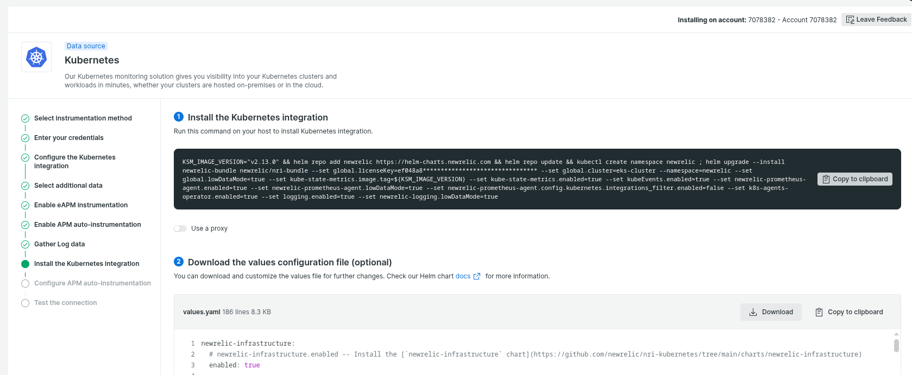
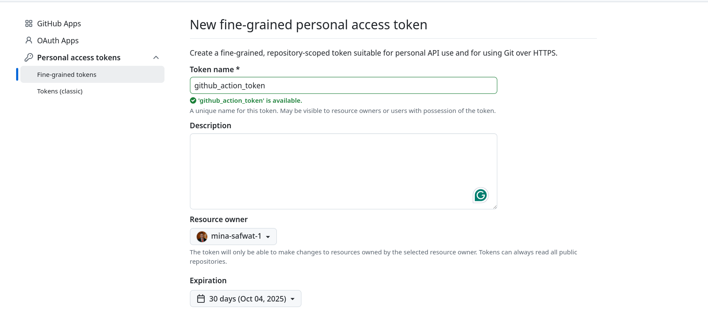
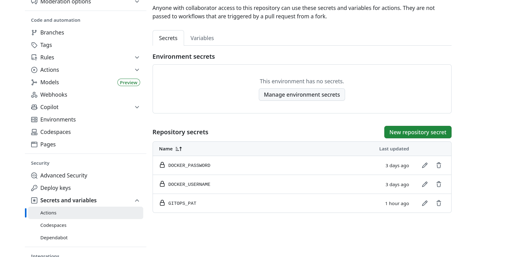
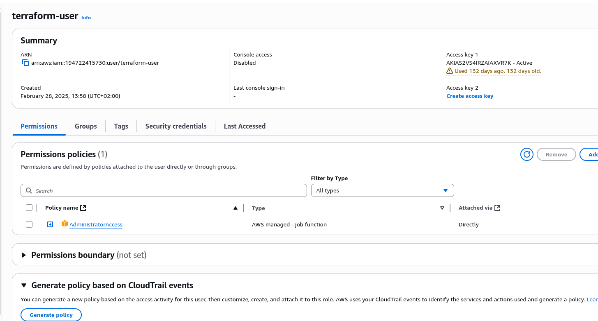
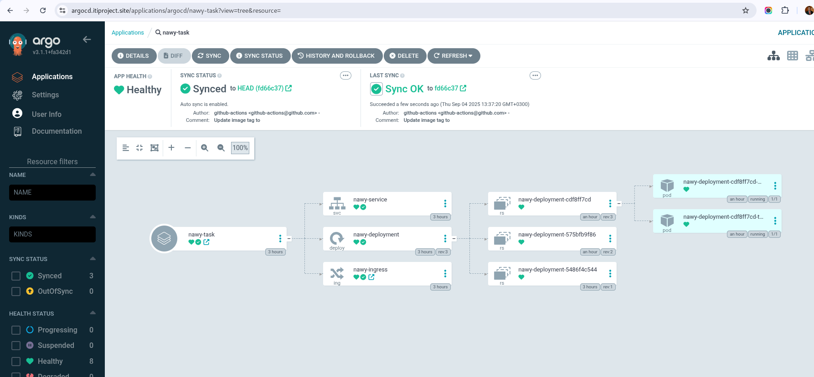
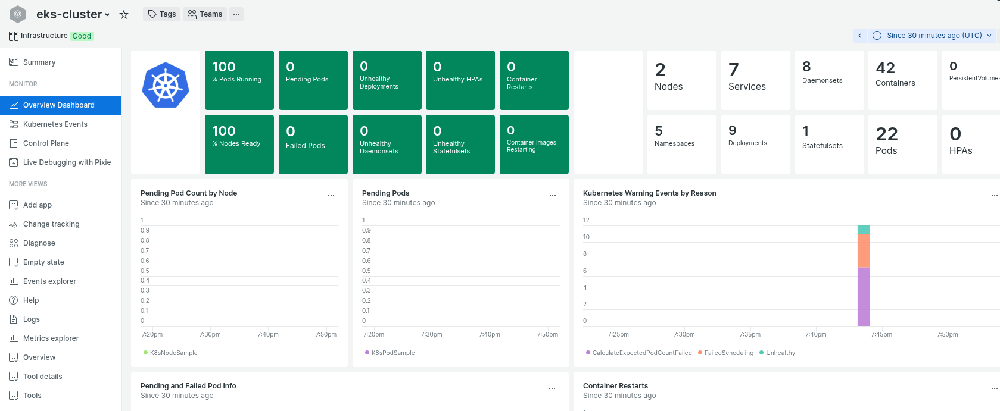

# Node Hello World

A minimal Node.js application that serves a simple "Hello World" message, designed for easy deployment and testing in cloud environments.

---

## Overview

This repository contains a basic Node.js application, along with deployment configurations for **Kubernetes**, **ArgoCD**, and **Terraform**. It is ideal for learning or testing GitOps workflows and cloud deployments.

---

## Prerequisites

Make sure the following tools and accounts are available:

* [kubectl](https://kubernetes.io/docs/tasks/tools/)
* [Helm](https://helm.sh/docs/intro/install/)
* [Terraform](https://developer.hashicorp.com/terraform/downloads)
* [Docker](https://www.docker.com/get-started)
* DockerHub account
* AWS CLI
* New Relic account

---

## Related Repositories (Fork both)

* [Application Source Code](https://github.com/mina-safwat-1/node-hello)
* [Deployment Manifests / GitOps](https://github.com/mina-safwat-1/nawy-task-gitops-repo)

---

## Initial Setup

Before deploying, complete the following:

1. Configure **New Relic** and obtain your `NEW_RELIC_LICENSE_KEY`.



2. Fork the GitOps repository.
3. Create a **GitHub token** for the GitOps repository (to allow write access).


4. Add this token to your application repository **secrets**.
5. Add DockerHub credentials (username and token) to repository secrets.

6. create Iam role or Iam user in aws to configure it.

7. Fork [Deployment Manifests / GitOps](https://github.com/mina-safwat-1/nawy-task-gitops-repo)


---

## Deploying steps

### 1. Clone the Repository

```bash
git clone <forked_repo_url>
cd node-hello
```


---

### 2. Configure AWS 

```bash
aws configure
```
Enter your credentials

---

### 3. Terraform Setup

#### Infrastructure Layer

```bash
cd terraform/infra
touch prod.tfvars
```

Add the following to `prod.tfvars`:

```hcl
subdomains = ["argocd.your-domain", "www.your-domain"]
domain_name = "your-domain-in-route53"
```

Initialize and apply Terraform:

```bash
terraform init
terraform apply -var-file="prod.tfvars" -auto-approve
```

#### Workloads Layer

```bash
cd ../workloads
touch prod.tfvars
```

Add the following to `prod.tfvars`:

```hcl
newrelic_license_key = "your_new_relic_key"
domain_name = "your-domain"
```

Initialize and apply Terraform:

```bash
terraform init
terraform apply -var-file="prod.tfvars" -auto-approve
```

---

### 4. Deploy with ArgoCD

Update the ArgoCD application YAML with your repository details:

```yaml
# argocd-application-nawy-task.yaml
apiVersion: argoproj.io/v1alpha1
kind: Application
metadata:
  name: nawy-task
  namespace: argocd
spec:
  project: default
  source:
    repoURL: 'https://github.com/mina-safwat-1/nawy-task-gitops-repo.git'
    targetRevision: HEAD
    path: nawy-chart
  destination:
    server: 'https://kubernetes.default.svc'
    namespace: default
  syncPolicy:
    automated:
      prune: true
      selfHeal: true
    retry:
      limit: 5
      backoff:
        duration: 5s
        factor: 2
        maxDuration: 3m
```

Apply the ArgoCD application:

```bash
cd node-hello/argocd-application
kubectl apply -f application.yaml
```
## You can access this dashboard using this domain argocd.yourdomain.com

#### to get credentials

Default user is admin

you can get password
```bash
kubectl -n argocd get secret argocd-initial-admin-secret -o jsonpath="{.data.password}" | base64 -d
```



---

## newrelic dashboard

you can access it from https://newrelic.com/




---


## Accessing the Application

Once deployed, the application can be accessed at:

```
https://www.yourdomain.com
```


---
